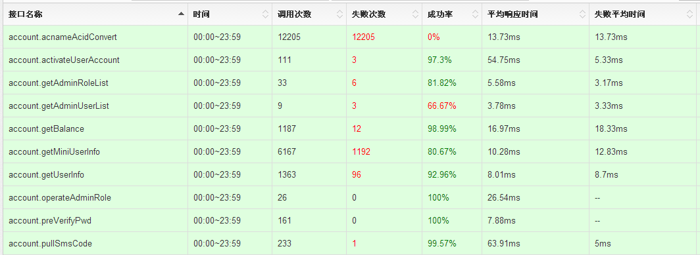
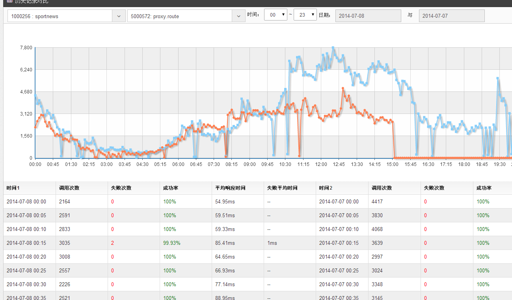
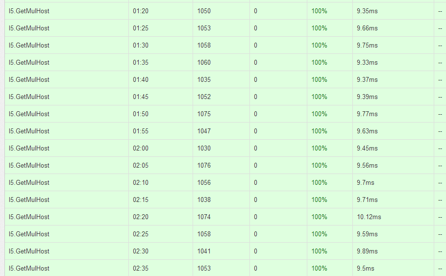
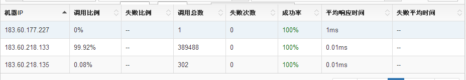

多玩数据统计平台
==============
多玩数据统计平台是一套接口调用量和成功率统计的工具，只需要在业务代码中加入统计代码，看到每个接口调用的成功率，调用量，错误码，IP分布等信息。

模调系统可以帮助项目开发者分析系统问题和性能瓶颈、了解模块接口的调用情况。
项目的接口一旦出现故障，项目的开发负责人会即时得到报警信息，快速定位故障。
目前欢聚宝、游戏特权、游戏刷子、体育刷子4个项目已经接入模调统计系统。

Web平台地址：[http://stats.duowan.com/](http://stats.duowan.com/)

模调系统提供的功能有：
----------

一、接口调用次数、失败次数、成功率、平均耗时、失败请求耗时




二、历史数据对比，可以看到与前N天的数据对比


三、错误码统计、错误被调ServerIP分布


四、 时段调用视图，可以清楚看到某个时间段内接口调用的变化


五、 主调IP，被调IP分 布视图，可以清楚的看到每一台机器调用的数量，失败次数等信息


六、失败率报警、数据波动报警（正在开发中）


模调系统接入的方法：
----------

目前我们使用中心Server，节点发送UDP包的方式进行统计上报。对业务代码没有影响，即使模调统计中心宕机也不影响项目运行。
我们提供了PHP，C++，Java 3种统计上报SDK。具体请联系 石光启 / 韩天峰 / 魏文晗。

PHP
```
StatsCenter::setServerIp(string $ip)
```

* 设置上服务的ip地址[可以联系统获得当前服务地址]

```
StatsCenter::tick($interface, $module, $force=false)
```

* 设置上报接口和模块
* 模块id到模调后台服申;若$interface为数字,则处为接口id,若$interfac为字符串,SDK将为该字符串自动创建接口,注册到服端

```
StatsCenter->report($success, $ret_code, $server_ip)
```

* $success,本次调用成功还是失败,1 成功,0 失败
* $ret_code,返回状态码
* $server_ip,调用者的ip地址
* ret_code 为0 不会出后台饼中, 非0才会出现

```
StatsCenter->reportSucc($success, $server_ip)
```

* $success,本次调用成功还是失败,1 成功,0 失败
* $server_ip,调用者的ip地址
* 只关心成功还是失败,自动将返回码填充0,统不会出现在饼图中

```
StatsCenter->reportCode($ret_code, $server_ip)
```

* $ret_code,返回状态码
* $server_ip,调用者的ip地址
* 若状态码为0,表示成功,统计不会出现在饼图中;若状态码不为0,表失败,统计状态码会出现在饼图中

完整例子:
test.php
```
<?php
require __DIR__.'/../api/php/StatsCenter.php';
$n = empty($argv[1]) ? 10000 : intval($argv[1]);
$tid = empty($argv[2]) ? 0 : intval($argv[2]);
$ifs = array(
    array(
        'id' => 5000369,
        'use_min' => 30000,
        'use_max' => 99000,
        'fail_ms' => 60000,
        'server_ip' => array(
            '10.99.56.32',
            '10.199.3.10',
            '10.99.56.11',
            '172.0.0.3',
        ),
    ),
    array(
        'id' => 5000371,
        'use_min' => 10000,
        'use_max' => 80000,
        'fail_ms' => 78000,
        'server_ip' => array(
            '10.99.56.32',
            '10.199.3.10',
            '10.99.56.11',
            '172.0.0.3',
        ),
    ),
    array(
        'id' => 5000372,
        'use_min' => 10000,
        'use_max' => 80000,
        'fail_ms' => 78000,
        'server_ip' => array(
            '10.99.56.32',
            '10.199.3.10',
            '10.99.56.11',
            '172.0.0.3',
        ),
    ),
    array(
        'id' => 5000373,
        'use_min' => 10000,
        'use_max' => 80000,
        'fail_ms' => 78000,
        'server_ip' => array(
            '10.99.56.32',
            '10.199.3.10',
            '10.99.56.11',
            '172.0.0.3',
        ),
    ),
);

StatsCenter::setServerIp('127.0.0.1');//设置上报服务地址

for($i = 0; $i< $n; $i++)
{
    $stat = StatsCenter::tick($ifs[$tid]['id'], 1000238);
    $ms = rand($ifs[$tid]['use_min'], $ifs[$tid]['use_max']);
    usleep($ms); //120ms
    if ($ms > $ifs[$tid]['fail_ms'])
    {
        $succ = StatsCenter::FAIL;
        $ret_code = rand(1001, 1006);
    }
    else
    {
        $succ = StatsCenter::SUCC;
        $ret_code = 0;
    }
    $ip_i = array_rand($ifs[$tid]['server_ip']);
    $stat->report($succ, $ret_code, $ifs[$tid]['server_ip'][$ip_i]);
}
```
```
php test.php 0 10000
```

C++

```
StatsCenter::StatsCenter(int module_id)
```
* module_id,模块id

```
bool StatsCenter::tick(int interface_id)
```

*  module_id,接口id

```
bool StatsCenter::report(bool sucess, int retCode, string& callIp)
```
* success,本次调用成功还是失败,1 成功,0 失败
* retCode,返回状态码
* callIp,调用者的ip地址

完整例子:
需在mostat.hh配置上报服务地址
```
#define STAT_SERVER "119.147.176.30"
#define STAT_PORT 9903
```

```
#include "mostat.hh"

using namespace std;

int main(int argc, char **argv)
{
	StatsCenter *sc = new StatsCenter(1000283);
	sc->connect();

	string serverip = "172.16.54.223";

	for (int i = 0; i < 500; i++)
	{
		sc->tick(5001881);
		usleep(200000);
		sc->report(false, 9999, serverip);
	}
	delete sc;
}
```

JAVA

```
模块调用的相关统计数据
```
```
void ModData::setApiId(int apiId)
```
* apiId 接口ID

```
void ModData::setUsedTimeMs(int usedTimeMs)
```
* usedTimeMs 调用耗时

```
void ModData::setErrorCode(int errorCode)
```
* errorCode 错误码

```
void ModData::setSuccess(boolean success)
```
* success 接口是否调用成功

```
void ModData::setApiServerIp(String apiServerIp)
```
* apiServerIp 被调用的API的IP

```
void SimpleModClientImpl::pushDataToCurrentThread(ModData data)
```
* 添加发送数据

```
int SimpleModClientImpl::sendDataOfCurrentThread()
```
* 上当前数据

完整实例:

```
package com.duowan.modclient;

import static org.junit.Assert.*;

import org.junit.After;
import org.junit.Before;
import org.junit.Test;

public class ModClientTester {
	
	ModClient client;

	@Before
	public void setUp() throws Exception {
		client = ModClientFactory.getInstance();
	}

	@After
	public void tearDown() throws Exception {
	}

	@Test
	public void testSendDataOfCurrentThread() {
		client.cleanCurrentThread();
		int appId = 5001806;

		for (int i = 0; i < 1000; i++) {
			ModData data = new ModData();
			data.setApiId(appId);
			data.setCurrentTimeSec((int)(System.currentTimeMillis()/1000));
			data.setErrorCode(i);
			data.setSuccess(true);
			data.setUsedTimeMs(10);
			data.setApiServerIp("192.168.2.1");
			client.pushDataToCurrentThread(data);
			
			ModData data1 = new ModData();
			data1.setApiId(appId);
			data1.setCurrentTimeSec((int)(System.currentTimeMillis()/1000));
			data1.setErrorCode(3);
			data1.setSuccess(false);
			data1.setUsedTimeMs(11);
			data1.setApiServerIp("192.168.2.2");
			client.pushDataToCurrentThread(data1);
		}
		
		client.sendDataOfCurrentThread();
	}

	@Test
	public void testSentModDataImmediately() throws InterruptedException {
		ModFuture future = client.initModFuture(5001806, "192.168.1.100");
		Thread.sleep(100);
		future.finishAndSend(true, 100);
	}

}

```

ChangeLog：
----------
PHPSDK 增加脚本超时自动发包机制                                     2015-01-07
* 脚本执行超时，自动上发一包标记本次请求超市，错误码为 -- 4444，统计结果可以通过后台在饼图中查每天或者每个时间段的超时信息
* 测试结果
php report.php 10000

```
ini_set('display_errors', '1');
error_reporting(-1);
set_time_limit(15);
. //省略代码
.
.
for($i = 0; $i < $n; $i++)
{
    $stat = StatsCenter::tick($ifs[$tid]['id'], 1000255);
    echo "$i \n";
    if ($i == 100)
    {
        $j = 0;
        while(1)
        {
            $j += 1;
        }
        echo $j;
    }

    $ms = rand($ifs[$tid]['use_min'], $ifs[$tid]['use_max']);
    usleep($ms); //120ms
    if ($ms > $ifs[$tid]['fail_ms'])
    {   
        $succ = StatsCenter::FAIL;
        $ret_code = rand(1001, 1006);
    }   
    else
    {   
        $succ = StatsCenter::SUCC;
        $ret_code = rand(2001,2006);
    }   
    $ip_i = array_rand($ifs[$tid]['server_ip']);
    $stat->report($succ, $ret_code, $ifs[$tid]['server_ip'][$ip_i]);
}
```

* 结果

```
... //前面省略
97 
98 
99 
100 
PHP Fatal error:  Maximum execution time of 15 seconds exceeded in /home/shiguangqi/workspace/module_stats_sdk/tests/report.php on line 91
//执行到100次 超时报错

//发包情况

14:33:09.033778 IP localhost.60812 > localhost.9903: UDP, length 1450
14:33:24.180422 IP localhost.37261 > localhost.9903: UDP, length 1050
14:33:24.180664 IP localhost.45795 > localhost.9903: UDP, length 25

//发包100 x 25 的2500 长度后报错，发最后一个超时包
```

* 2015-01-20 15:57:00  统计增加每个时间片的最大与最小响应时间的统计与展示